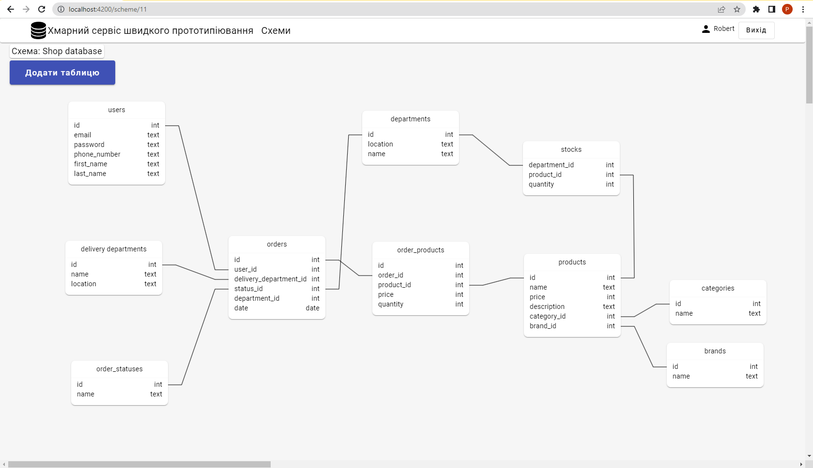
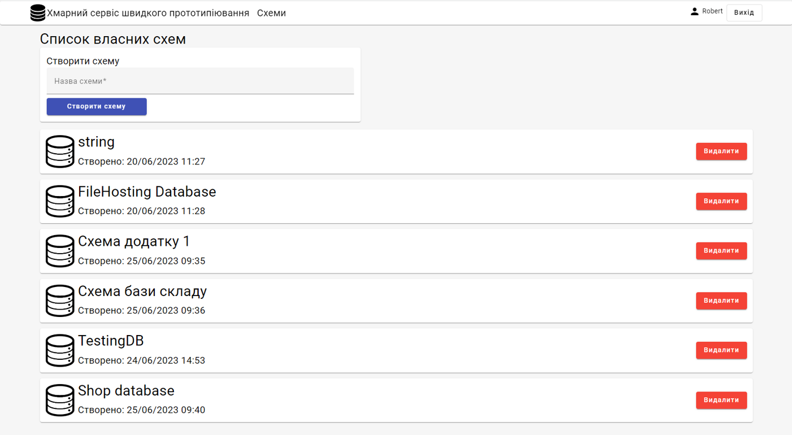
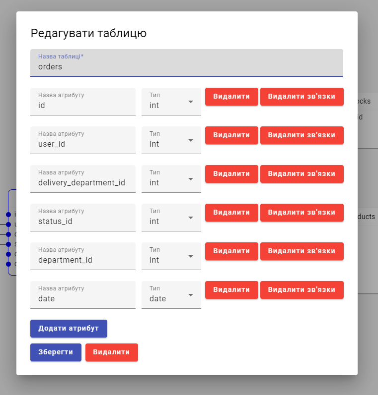

# Database Schema Editor
## Interactive client-server app which allows to create and edit database schemas

Project built using ASP.NET Web API and Angular, it includes functionality described below:
- Authentication and authorization
- Creating multiple schemas by the user
- Creating, deleting, modifying, and moving database tables
- Creating, editing, and deleting table attributes
- Setting attribute types
- Creating and deleting connections between attributes

## Preview
### Schema page

### Schema list page

### Table editing form

